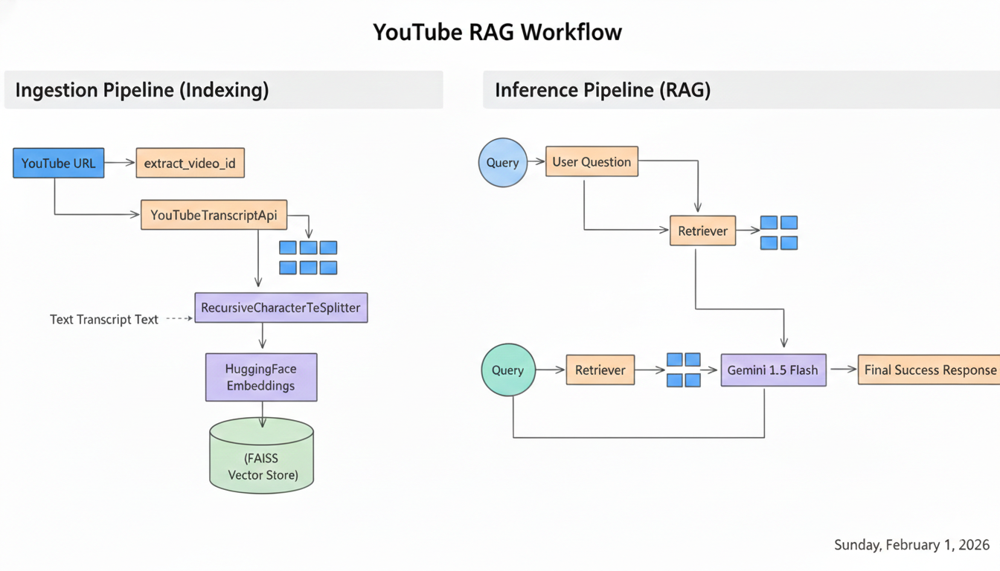

# 📘 StudyRAG

**StudyRAG** is an AI-powered study assistant that lets you upload lecture notes (PDF or TXT) and ask questions directly from them.  
It uses a **Retrieval-Augmented Generation (RAG)** pipeline with conversational memory to provide accurate, context-aware answers strictly based on your notes.

---

## ✨ Features

- 📂 Upload lecture notes in **PDF or TXT** format  
- ❓ Ask natural-language questions from your notes  
- 🧠 Conversational memory for follow-up questions  
- 🚫 No hallucinations — answers only from provided content  
- ⚡ Fast semantic search using **FAISS**  
- 🎨 Clean and simple **Streamlit UI**  

---

## 🧠 How It Works

1. User uploads lecture notes (PDF or TXT)  
2. Text is extracted and split into chunks  
3. Chunks are embedded using **Hugging Face embeddings**  
4. **FAISS** retrieves the most relevant chunks  
5. A **Gemini LLM** generates an answer using:
   - Retrieved context
   - Previous chat history (memory)
6. The answer is shown and stored for follow-up questions  

This ensures responses are **grounded, explainable, and accurate**.

---

## 🧠 RAG Flow Diagram



---

## 🛠 Tech Stack

- **Python**
- **Streamlit**
- **LangChain (Runnables API)**
- **Google Gemini**
- **FAISS**
- **Hugging Face Embeddings**
- **PyPDF**

---

## 🚀 Getting Started

### 1️⃣ Clone the repository
```bash
git clone https://github.com/your-username/studyrag.git
cd studyrag
```

### 2️⃣ Create a virtual environment
```bash
python -m venv venv
source venv/bin/activate   # On Windows: venv\Scripts\activate
```

### 3️⃣ Install dependencies
```bash
pip install -r requirements.txt
```

### 4️⃣ Set environment variables

Create a `.env` file:
```env
GOOGLE_API_KEY=your_google_gemini_api_key
HF_TOKEN=your_huggingface_token
```

### 5️⃣ Run the app
```bash
streamlit run app.py
```

---

## 🧪 Example Use Cases

- Studying from lecture notes and PDFs  
- Exam preparation and quick revision  
- Understanding complex topics from class material  
- Demonstrating a real-world **RAG + memory** system  

---

## 📌 Notes

- This project is **cloud-safe** (no web scraping or ToS issues)  
- Memory is session-based (per user, per browser session)  
- Ideal as a **portfolio project** or learning reference  

---

## ⭐ Why This Project Matters

- Demonstrates real-world **RAG architecture**
- Shows correct handling of **conversational memory**
- Clean separation of retrieval and generation
- Production-aware design choices

---

## 🔮 Future Improvements

- Multiple file uploads  
- Persistent memory (DB / Redis)  
- Exam mode (short answers only)  
- Highlight retrieved chunks  
- Support for DOCX files  

---

Happy learning! 🎓
